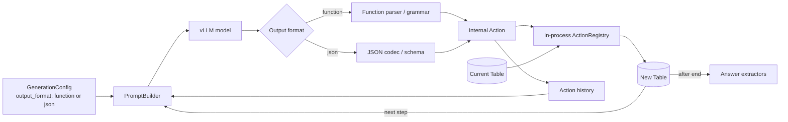
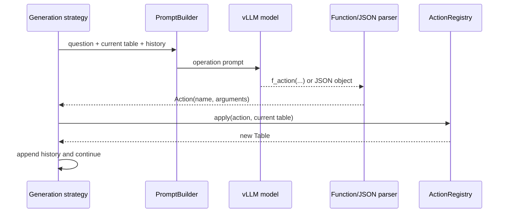
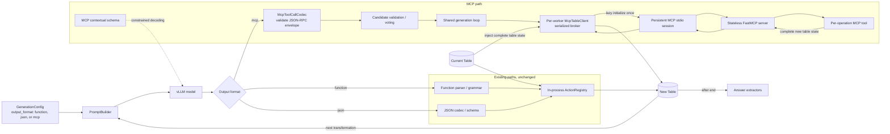
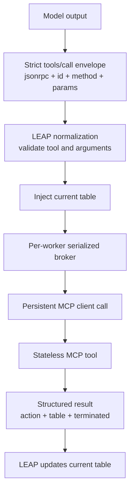
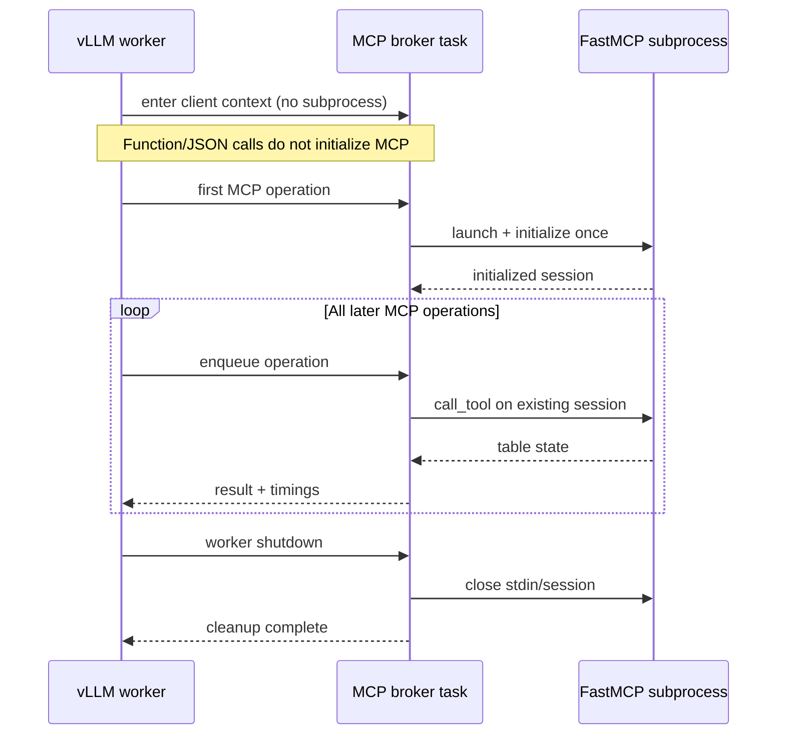
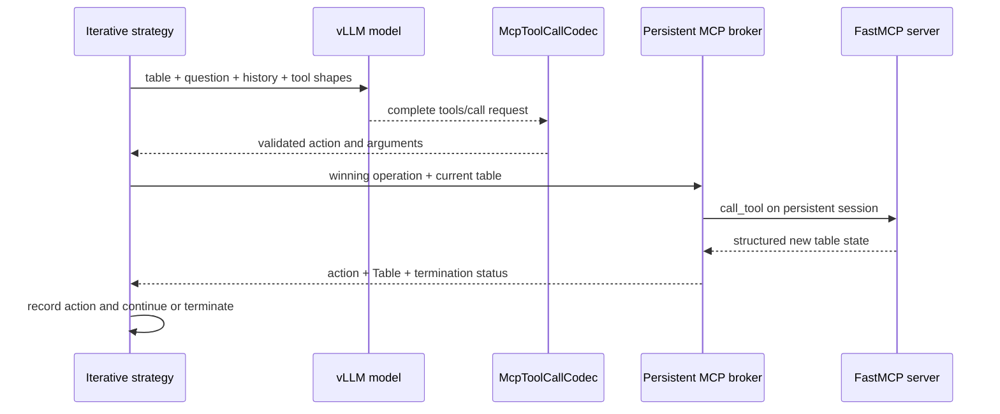
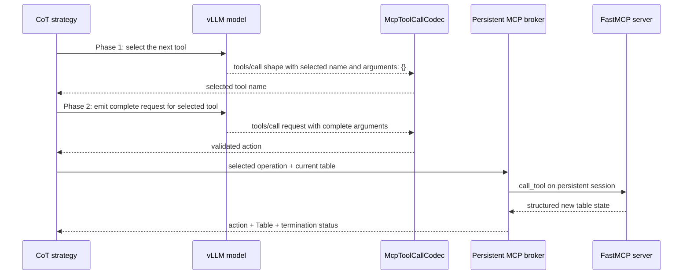

# MCP Table-Transformation Architecture

This document compares LEAP's original function/JSON operation path with the MCP-backed path added as `generation.output_format: mcp`.

## Before: local operation parsing and execution

In the original architecture, the model emitted either function syntax or a named JSON object. LEAP parsed the output into an internal `Action` and applied that action directly through the in-process action registry.



### Before: information flow



The table never crossed a process or protocol boundary. `Action.apply_to_table()` delegated directly to the registered Python action implementation.

## After: selectable MCP execution path

Function and JSON modes remain available and retain their original execution path. MCP is an additional output mode. In MCP mode, the model emits an official JSON-RPC `tools/call` envelope, LEAP validates and normalizes it, and the selected transformation is executed by a stateless MCP server over stdio.



## MCP request and response boundary

The model-facing request contains the operation name and its arguments, but not the table. LEAP owns the current table and injects it before invoking the server.



Example model output:

```json
{
  "jsonrpc": "2.0",
  "id": "step",
  "method": "tools/call",
  "params": {
    "name": "sort_by",
    "arguments": {
      "column": "Score",
      "order": "desc"
    }
  }
}
```

LEAP invokes the MCP tool with the runtime-owned table added to its arguments:

```json
{
  "name": "sort_by",
  "arguments": {
    "table": {
      "columns": ["Name", "Score"],
      "rows": [["Ada", "2"], ["Grace", "1"]]
    },
    "column": "Score",
    "order": "desc"
  }
}
```

The server returns the authoritative table state:

```json
{
  "action": "sort_by('Score', 'desc')",
  "table": {
    "columns": ["Name", "Score"],
    "rows": [["Ada", "2"], ["Grace", "1"]]
  },
  "terminated": false
}
```

## Persistent worker lifecycle

Each vLLM worker enters one `McpTableClient` context before its request loop. Entering the context creates only a lightweight broker task. The broker lazily launches and initializes the stdio server on the first MCP call, serializes calls from concurrent inference tasks, and retains the session until worker shutdown. Function/JSON-only workers never launch the subprocess.



If transport startup or a warm call fails, the broker closes the session, reconnects, and retries that stateless call once. Tool validation errors are returned without reconnecting or retrying.

## Iterative MCP flow

Iterative mode generates one complete MCP request per transformation step.



## Two-stage CoT MCP flow

CoT retains its two-stage generation behavior. The selection-stage envelope is used for planning and is not dispatched because its `arguments` object is intentionally empty. The complete second-stage envelope is validated and executed through MCP.



## Tool surface

| MCP tool | Input besides `table` | Result |
|---|---|---|
| `select_row` | `rows: list[str]` | Selected rows |
| `select_column` | `columns: list[str]` | Selected columns |
| `add_column` | `column: str`, `values: list[str]` | Table with one new value per row |
| `group_by` | `column: str` | Group counts |
| `sort_by` | `column: str`, `order: "asc" \| "desc"` | Sorted rows |
| `end` | None | Unchanged table with `terminated: true` |

`add_column` validates that the new column name is unused and that the values list contains exactly one string per table row.

## State ownership and compatibility

- **LEAP runtime owns table state:** the persistent server process does not retain tables or operation state between calls.
- **The MCP server owns transformation execution in MCP mode:** its returned table replaces the runtime's current table.
- **The model never owns or transmits hidden server state:** it chooses only the tool and operation arguments.
- **Function and JSON compatibility is preserved:** those modes continue to parse into `Action` and execute locally.
- **Termination remains compatible:** MCP `end` is executed by the server, after which LEAP runs the existing answer extractors.

## Relevant implementation files

| Responsibility | File |
|---|---|
| MCP envelope codec and schemas | `leap/mcp/protocol.py` |
| MCP stdio client adapter | `leap/mcp/client.py` |
| Stateless FastMCP server and tools | `leap/mcp/server.py` |
| Model prompts | `leap/generation/prompt_builder.py` |
| Candidate generation and parsing | `leap/generation/sampling.py` |
| Table-state integration | `leap/generation/strategies.py` |
| Configuration validation | `leap/config/loader.py` |
| Protocol and schema tests | `tests/test_mcp_protocol.py` |
| Client lifecycle and recovery tests | `tests/test_mcp_client.py` |
| MCP server round-trip tests | `tests/test_mcp_server.py` |
| Worker lifecycle tests | `tests/test_vllm_server.py` |
