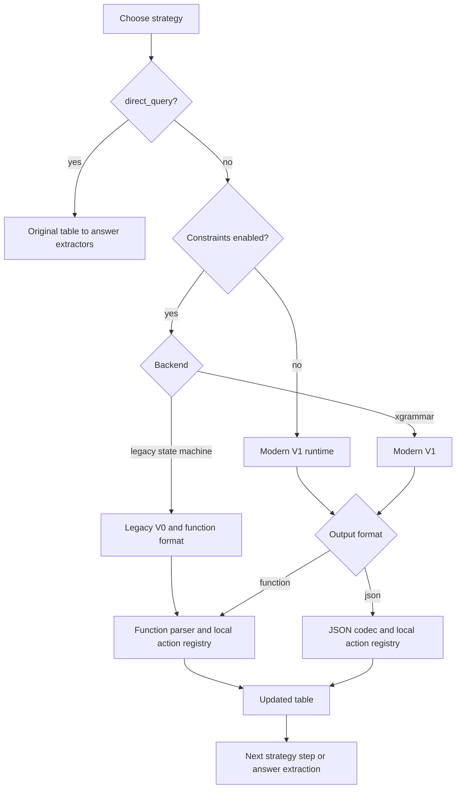
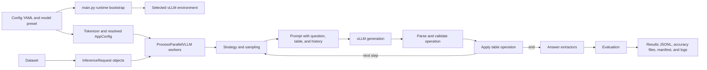
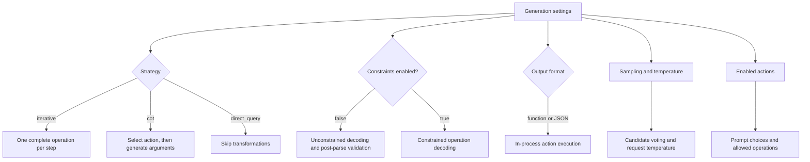

# LEAP backend handover

## Project introduction

LEAP reproduces Chain-of-Tables (COT), a framework that aims to enhance LLM's reasoning over (semi-structured) tabular structured data for table based question answering tasks. Furthermore, it extends COT with multiple strategies for constrained generations that attempt to minimize erronous generation (validity failures) as well as invlaid argument generation.

Chain-of-Table attempts to improve reasoning by evolving tables within a chain where a table is transformed repeatedly, using atomic table operations, into a suitable state for downstrean answer extraction. 

The framework runs over examples containing a natural-language question, a table, and one or more reference answers. The model can select rows or columns, group rows, sort a column, add a derived column, and finish the reasoning chain with the `end()` operation. Each successful operation produces the table passed to the next step. For example, a question about the highest score may lead to `sort_by("Score", "desc")`, followed by `end()`.

After the operation sequence terminates, COT runs the configured answer extractors on the final table and compares the generated answer with the dataset's reference answer using denotation matching, which checks answer values rather than the wording of the model response.

## Constraints

Constraints generation marks one of the key contribution of LEAP. Constraints limit the operation text available to the decoder. They reduce malformed output and invalid table references, but they do not establish that an action sequence answers the question. LEAP still parses model output and validates the action against the current table after decoding.

| Mode | Decode-time restriction | Post-decode checks | Runtime and compatibility |
|---|---|---|---|
| Unconstrained | None. The model emits normal text. | The system parses the generated operation, checks that it is valid, and checks it against the current table. Malformed candidates are discarded. | Modern vLLM V1 backend. `constraint_backend` does not activate legacy processing when `use_constraints: false`. |
| Legacy state machine | A Python state machine tracks the function-call phase, action, arguments, and action history. Its logits processor masks token IDs at each decoding step. | Parser and table validation apply. | vLLM 0.10.0 with V0. Function output only. |
| XGrammar function | An XGrammar grammar restricts function syntax, enabled action names, current row identifiers, current column names, sort order, and `add_column` value count. | Parser and table validation apply. | vLLM >=0.12,<0.13 with V1. |
| XGrammar JSON | A JSON Schema restricts action fields and most argument domains. The modern structured-output backend turns the schema into token-level decoding constraints. | The JSON codec rejects duplicate selections and operations invalid for the current table. | Modern V1 only. |

The two constrained approaches use different kinds of state machine. The legacy backend implements one directly in Python. It tracks states such as the expected function name, argument position, and whether a list item has already been selected, then applies a custom logits processor to mask the tokenizer's next-token choices. It emits the legacy function-style COT output. 

[XGrammar](https://github.com/mlc-ai/xgrammar) is a library for structured generation. It accepts a context-free grammar or JSON Schema, compiles it against the model's tokenizer, and tracks which output prefixes remain valid. At each decoding step, it masks tokens that would make the prefix invalid, so the model samples only from structurally valid continuations. LEAP builds a grammar or JSON Schema from the current table and action history for each request, and vLLM uses XGrammar as its structured-output backend. Function mode describes calls such as `f_sort_by(...)`, while JSON mode describes a flat action object. Both pass through LEAP's parser and table validation after decoding.

Since the legacy constraint mode requires an older vLLM version, the depedency is loaded dynamically. `main.py` chooses `.venv-vllm-legacy` only when active legacy function constraints require it. Unconstrained runs and XGrammar runs use `.venv-vllm-modern`. The environments remain separate because their supported vLLM versions are incompatible.

### Global action constraints

By default for the first action, `end` is unavailable. After a non-`end` action has been invoked, the system removes that action from the list of available actions. For instance if `select_row` has been invoked `select_column`, `group_by`, `sort_by`, `add_column`, and `end` may be chosen next, provided they are enabled. `select_row` may not be invoked again.

Global constraints use the transition matrix in `leap/core/actions/registry.py`:

```text
start -> add_column | select_row | select_column | group_by | sort_by
add_column -> select_row | select_column | group_by | sort_by | end
select_row -> select_column | group_by | sort_by | end
select_column -> group_by | sort_by | end
group_by -> sort_by | end
sort_by -> end
```

For example using global constraints after `select_row` has been invoked `sort_by` may be chosen next but `add_column` may not be invoked next. We adopted the transition matrix as used in the [offical COT repo](https://github.com/google-research/chain-of-table).


### Output formats
| Output format | What the model emits and its constraint mode |
|---|---|
| `function` | A call such as `f_sort_by("Score", "desc")`. Legacy state-machine constraints explicitly use this format. XGrammar function constraints may also use it. |
| `json` | A named object such as `{"action":"sort_by","column":"Score","order":"desc"}`. Only XGrammar JSON constraints use this format. |

## Strategies

Besides the choice wether to constrain the generation and how to do so, LEAP also provides two different stratgies for the output mode. While `iterative` and `cot` may be constrainted, `direct_query` bypasses the table reasoning and may therefore be used as a baseline for experiments.  

| Choice | Model requests | Table transformation | Use in comparisons |
|---|---|---|---|
| `iterative` | One complete operation request at each step. Sampling can create multiple candidates for that request. | Applies the winning operation, then prompts again with the replacement table. | Main single-stage transformation method. |
| `cot` | Two requests at each step: select an action, then generate arguments for that selected action. | Applies the complete second-stage operation. Default selection temperature is 0 and argument temperature is 0.7. | Chain-of-Table implementation. |
| `direct_query` | No action-generation request. It runs answer extraction on the original table. | None. LEAP records `end()` and `direct_query()` immediately. | Baseline for the value of table transformations. |




Function and JSON execution keep table state in the LEAP worker process.

### Operation examples

For a table with `Name`, `Score`, and `Year` columns, valid function forms include:

```text
f_select_row(["row 0", "row 3"])
f_select_column(["Name", "Score"])
f_sort_by("Score", "desc")
f_group_by("Year")
f_end()
```

Structured function and JSON modes restrict `sort_by` to a current column and to `"asc"` or `"desc"`. They restrict row selections to current row identifiers, up to the 500-row grammar limit.

`add_column` creates model-supplied values. If the current table has three rows, the following call is valid only with exactly three quoted values:

```text
f_add_column("Rank", ["1", "2", "3"])
```

A two-value or four-value list fails validation. JSON mode also validates decoded text and the exact value count. A valid `add_column` call can still be wrong if its generated values do not answer the question.

## Backend architecture and data flow

`main.py` is the runnable backend entry point. It selects the required vLLM runtime, loads the tokenizer, configuration, and dataset, starts worker processes, dispatches examples, and writes the run outputs. It can run one configuration directly or execute a persistent experiment session created by `scripts/run_experiments.py`.

First `main.py` loads a YAML configuration through `leap.config.loader`, then creates a `ProcessParallelVLLM` server. The server starts worker processes that own vLLM engines. Each worker receives an `InferenceRequest`, runs the configured strategy, and returns an `InferenceResult` to the main process. The main process aggregates results and writes the persistent artifacts.



The runtime bootstrap happens before imports that load vLLM. It reads the constraint state, backend, and output format, then re-executes `main.py` in the matching generated environment. The resolved configuration controls the tokenizer, model hardware, enabled actions, generation method, extractors, dataset, and logging.

The strategy owns the current table and action history for one example. It passes both into the prompt builder. The sampling layer obtains one or more model candidates and accepts a valid operation. LEAP applies that operation locally. This loop ends at `end()`, after three generation failures, after three validity failures, or after ten action steps.

The final table, action history, reference answers, and extractor output go to evaluation. `main.py` writes `results.jsonl` with one record per example, `end_to_end_accuracy.json` with the run-level execution score, `extractor_accuracy.json` with per-extractor scores, and `run_config.json` with the resolved configuration and runtime metadata. When logging is enabled, workers also produce table-step logs under the run's `table_logs/` directory.

## Settings that affect behavior

The base settings are in `configs/default.yaml`. Per-model hardware and tokenizer settings are in `configs/models.yaml`. `configs/experiments.example.yaml` defines a comparison matrix that `scripts/run_experiments.py` expands into supported jobs.



| Setting | What it changes |
|---|---|
| `model.id` and hardware preset | Select the model, tokenizer details, worker count, GPU allocation, tensor parallelism, concurrency, and context limit. |
| `dataset` and `run.max_examples` | Select input examples and cap the number processed. The cap takes the first examples in dataset order. |
| `generation.strategy` | Selects iterative operation generation, two-stage Chain-of-Table generation, or the direct-query baseline. |
| `generation.enabled_actions` | Limits the actions available to prompts, parsers, and constrained decoding. |
| `generation.use_constraints` | Turns structured decoding on or off. With it off, LEAP still parses output and validates actions against the table after generation. |
| `generation.use_global_constraints` | Selects either local action-history restrictions or fixed global action transitions. |
| `generation.constraint_backend` | Selects the historical state-machine backend or XGrammar. The selection may also choose a different vLLM environment. |
| `generation.output_format` | Selects function-call or JSON operation messages. Legacy constraints force function output. |
| `generation.sampling` | Sets candidate counts, per-action sample counts, voting, and optional shuffle-invariant sampling. |
| `generation.force_zero_temperature` | Sets every model request to temperature 0, including CoT selection, arguments, and answer extraction. |
| `extractors` | Selects answer-generation methods run independently on the final table. Legacy end-to-end accuracy uses the `direct_query` extractor. |
| `logging` | Controls table-log creation and representation. Logs help diagnose runs but do not replace saved result records. |

The experiment runner groups compatible jobs by model and vLLM runtime when `reuse_models: true`. Strategy, output format, and generation settings may change within a compatible session without reloading the model. A model change, runtime switch, incompatible configuration, or failed worker can require a new model load.


## LEAP backend evolution

This timeline uses commits that changed `main.py` or `leap/`. It excludes visual-interface-only work and does not treat uncommitted files as project history.

| Period | Backend development | Representative commits |
|---|---|---|
| August 2025 | LEAP entered the repository from a playground implementation. Constraint logic moved into its own module, model calls were separated, logging returned, and global constraints became configurable. | `e1b34d1`, `b3774d6`, `7cafb4f`, `6abc59a`, `0191731`, `4ba3202` |
| October to December 2025 | The backend gained model-specific hardware settings, typed table and action data objects, a package layout, centralized configuration, worker-error isolation, continuous batching, profiling, and basic tests. `main.py` shifted toward orchestration while implementation moved into `leap/`. | `fdb9d4f`, `d95b41b`, `fec0ea6`, `db67baf`, `8992593`, `f67a9f2`, `212260e` |
| December 2025 to January 2026 | Multi-candidate sampling and shuffle-invariant sampling arrived. The action registry became the shared definition of actions, prompts, parsing, and constraints. The older Chain-of-Table flag became a strategy setting, and direct query became an automatic action after `end()`. | `9c36977`, `1aefd54`, `0e2e9e1`, `69909a5`, `f4ecd31` |
| February to March 2026 | Packaged tools and a substantial CoT refactor landed. Follow-up commits addressed per-row `add_column` sampling, duplicate actions, sort type handling, numeric commas, prompt behavior, and larger table support. | `6d83fba`, `1b645af`, `078bba6`, `425ca91`, `b7e1348`, `6ad9d85`, `b5bd93b` |
| June to July 2026 | Constraints broadened, while `add_column` constraints were temporarily removed during correctness work. XGrammar was added alongside the legacy state machine. Runtime selection then isolated V0 and V1 environments, and new answer extractors were added. | `104d79f`, `b138efd`, `76bc18d`, `088b4f6`, `4287498` |
| August 2026 | Global constraints and prompts were revised. JSON structured output, experiment matrices, persistent model reuse, worker health checks, and richer manifests made larger comparison suites practical. Later work restored constrained `add_column` with exact cardinality. | `4a43eb6`, `8d3d089`, `a70ae07`, `36b4751` |

The sequence matters. The project began as a constrained table-operation runner, then separated runtime responsibilities into configuration, core data types, generation strategies, inference workers, and evaluation. The later work preserved the historical legacy backend while adding a modern structured-decoding path. That compatibility split is why a reported result must name its constraint backend, vLLM runtime, and output protocol.

At the time of this handover, the working tree contains uncommitted backend and configuration changes. Record the commit and `git status --short` output with every experiment. A dirty-tree result may still be useful, but it is not directly reproducible from its commit alone.

## Final results

No final benchmark results have been entered. Add one row for each comparable experimental condition only after the full suite and its repeats are complete.

| Model | Dataset and split | Examples | Repeats | Strategy | Constraints | Backend | Format | Global mode | Enabled actions | Sampling | Temperature mode | End-to-end accuracy | Extractor accuracy | Validity or error rate | Mean latency | Run directories |
|---|---|---:|---:|---|---|---|---|---|---|---|---|---:|---:|---:|---:|---|
| To be completed |  |  |  |  |  |  |  |  |  |  |  |  |  |  |  |  |

Build the table from saved artifacts, not terminal output:

- `run_config.json` records the resolved configuration, paths, and vLLM runtime metadata.
- `results.jsonl` contains per-example actions, generated and reference answers, execution metrics, extractor results, and sampling metadata.
- `end_to_end_accuracy.json` contains the run-level primary score.
- `extractor_accuracy.json` contains each enabled extractor's score and their mean.
- The experiment report records job status, repeat outcomes, run time, failures, model-load reuse, and restart reasons.

Report variation across repeats when repeats exist. Keep direct-query baselines separate from transformation strategies. Do not compare legacy and modern constrained runs without naming their backend, vLLM runtime, and output protocol.

## How to run

Install development dependencies and the modern runtime:

```bash
uv sync --group dev --extra vllm-modern
```

Run one configuration:

```bash
uv run main.py
```

Run the example experiment matrix:

```bash
uv run scripts/run_experiments.py configs/experiments.example.yaml
```


