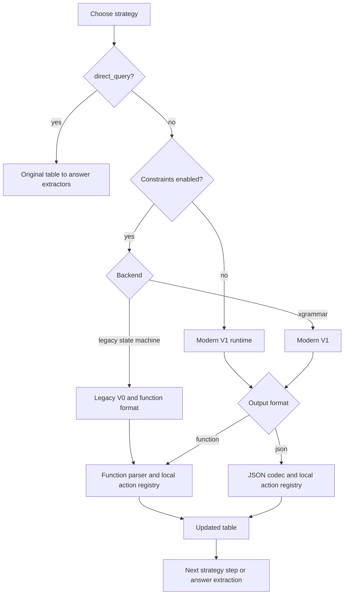
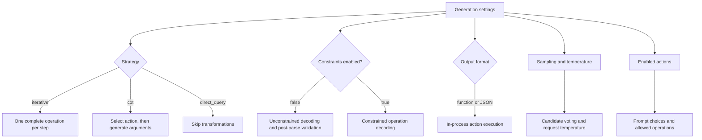

# LEAP backend handover

## Project introduction

LEAP reproduces Chain-of-Tables (COT), a framework that aims to enhance LLM reasoning over semi-structured tabular data for table-based question answering tasks. Furthermore, it extends COT with multiple strategies for constrained generation that attempt to minimize erroneous generation validity failures as well as invalid argument generation.

Chain-of-Table attempts to improve reasoning by evolving tables within a chain where a table is transformed repeatedly, using atomic table operations, into a suitable state for downstream answer extraction. 

The framework runs over examples containing a natural-language question, a table, and one or more reference answers. The model can select rows or columns, group rows, sort a column, add a derived column, and finish the reasoning chain with the `end()` operation. Each successful operation produces the table passed to the next step. For example, a question about the highest score may lead to `sort_by("Score", "desc")`, followed by `end()`.

After the operation sequence terminates, COT runs the configured answer extractors on the final table and compares the generated answer with the dataset's reference answer using denotation matching, which checks answer values rather than the wording of the model response. The `direct_query` extractor uses LEAP's normal `Query(T, Q)` prompt to ask the model for an answer from the final table. The `nl2sql` extractor implementation is copied from the official [AutoPrep repository](https://github.com/ruc-datalab/AutoPrep): it asks the model to produce a `SELECT` or `WITH` SQL query over the final table, executes it in an in-memory SQLite table, and returns the query result as the answer.

## Constraints

Constraints generation marks one of the key contribution of LEAP. Constraints limit the operation text available to the decoder. They reduce malformed output and invalid table references, but they do not establish that an action sequence answers the question. LEAP still parses model output and validates the action against the current table after decoding.

| Mode | Decode-time restriction | Post-decode checks | Runtime and compatibility |
|---|---|---|---|
| Unconstrained | None. The model emits normal text. | The system parses the generated operation, checks that it is valid, and checks it against the current table. Malformed candidates are discarded. | Modern vLLM V1 backend. `constraint_backend` does not activate legacy processing when `use_constraints: false`. |
| Legacy state machine | A Python state machine tracks the function-call phase, action, arguments, and action history. Its logits processor masks token IDs at each decoding step. | Parser and table validation apply. | vLLM 0.10.0 with V0. Function output only. |
| XGrammar function | An XGrammar grammar restricts function syntax, enabled action names, current row identifiers, current column names, sort order, and `add_column` value count. | Parser and table validation apply. | vLLM >=0.28,<0.29 with V1. |
| XGrammar JSON | A JSON Schema restricts action fields and most argument domains. The modern structured-output backend turns the schema into token-level decoding constraints. | The JSON codec rejects duplicate selections and operations invalid for the current table. | Modern V1 only. |

The two constrained approaches use different kinds of state machine. The legacy backend implements one directly in Python. It tracks states such as the expected function name, argument position, and whether a list item has already been selected, then applies a custom logits processor to mask the tokenizer's next-token choices. It emits the legacy function-style COT output. 

[XGrammar](https://github.com/mlc-ai/xgrammar) is a library for structured generation. It accepts a context-free grammar or JSON Schema, compiles it against the model's tokenizer, and tracks which output prefixes remain valid. At each decoding step, it masks tokens that would make the prefix invalid, so the model samples only from structurally valid continuations. LEAP builds a grammar or JSON Schema from the current table and action history for each request, and vLLM uses XGrammar as its structured-output backend. Function mode describes calls such as `f_sort_by(...)`, while JSON mode describes a flat action object. Both pass through LEAP's parser and table validation after decoding.

Since the legacy constraint mode requires an older vLLM version, the dependency is loaded dynamically. `main.py` chooses `.venv-vllm-legacy` only when active legacy function constraints require it. Unconstrained runs and XGrammar runs use `.venv`. The environments remain separate because their supported vLLM versions are incompatible.

### Global action constraints

By default for the first action, `end` is unavailable. After a non-`end` action has been invoked, the system removes that action from the list of available actions. For instance if `select_row` has been invoked `select_column`, `group_by`, `sort_by`, `add_column`, and `end` may be chosen next, provided they are enabled. `select_row` may not be invoked again.

Global constraints use the transition matrix in `leap/core/actions/registry.py`:

```text
start -> add_column | select_row | select_column | group_by | sort_by
add_column -> select_row | select_column | group_by | sort_by | end
select_row -> select_column | group_by | sort_by | end
select_column -> group_by | sort_by | end
group_by -> sort_by | end
sort_by -> end
```

For example using global constraints after `select_row` has been invoked `sort_by` may be chosen next but `add_column` may not be invoked next. We adopted the transition matrix as used in the [official COT repo](https://github.com/google-research/chain-of-table).


### Output formats
| Output format | What the model emits and its constraint mode |
|---|---|
| `function` | A call such as `f_sort_by("Score", "desc")`. Legacy state-machine constraints explicitly use this format. XGrammar function constraints may also use it. |
| `json` | A named object such as `{"action":"sort_by","column":"Score","order":"desc"}`. Only XGrammar JSON constraints use this format. |

## Strategies

Besides the choice whether to constrain the generation and how to do so, LEAP also provides two different strategies for the output mode. While `iterative` and `cot` may be constrained, `direct_query` bypasses the table reasoning and may therefore be used as a baseline for experiments.  

| Choice | Model requests | Table transformation | Use in comparisons |
|---|---|---|---|
| `iterative` | One complete operation request per attempt. No voting or shuffle sampling. | Validates and applies that operation, then prompts again with the replacement table. | Main single-stage transformation method. |
| `cot` | Select an action once, then generate arguments. With sampling enabled, row/column selection gets eight argument candidates; other actions get one. `end` needs no arguments. | Votes over selection candidates and applies the operation. Default selection temperature is 0 and argument temperature is 0.7. | Chain-of-Table implementation. |
| `direct_query` | No action-generation request. It runs answer extraction on the original table. | None. LEAP records `end()` and `direct_query()` immediately. | Baseline for the value of table transformations. |




Function and JSON execution keep table state in the LEAP worker process.

The sampling policy applies to both output formats and constrained/unconstrained
runs. Disabling sampling makes CoT argument generation single-shot too. Legacy
sample-count settings cannot override the policy. Shuffle sampling is limited to
CoT row selection. Earlier iterative results may use multiple candidates and
should not be treated as the same sampling configuration as new single-shot runs.

Action requests use final-only vLLM output; token-level constraints still apply
throughout decoding. CoT calculates the full-column token budget only for
`add_column`. No grammar validation or cardinality checks are removed.

### Operation examples

For a table with `Name`, `Score`, and `Year` columns, valid function forms include:

```text
f_select_row(["row 0", "row 3"])
f_select_column(["Name", "Score"])
f_sort_by("Score", "desc")
f_group_by("Year")
f_end()
```

Structured function and JSON modes restrict `sort_by` to a current column and to `"asc"` or `"desc"`. They restrict row selections to current row identifiers, up to the 500-row grammar limit.

`add_column` creates model-supplied values. If the current table has three rows, the following call is valid only with exactly three quoted values:

```text
f_add_column("Rank", ["1", "2", "3"])
```

A two-value or four-value list fails validation. JSON mode also validates decoded text and the exact value count. A valid `add_column` call can still be wrong if its generated values do not answer the question.

## Settings that affect behavior

The base settings are in `configs/default.yaml`. Per-model hardware and tokenizer settings are in `configs/models.yaml`. `configs/experiments.example.yaml` defines a comparison matrix that `scripts/run_experiments.py` expands into supported jobs.



| Setting | What it changes |
|---|---|
| `model.id` and hardware preset | Select the model, tokenizer details, worker count, GPU allocation, tensor parallelism, concurrency, and context limit. |
| `dataset` and `run.max_examples` | Select input examples and cap the number processed. The cap takes the first examples in dataset order. |
| `generation.strategy` | Selects iterative operation generation, two-stage Chain-of-Table generation, or the direct-query baseline. |
| `generation.enabled_actions` | Limits the actions available to prompts, parsers, and constrained decoding. |
| `generation.use_constraints` | Turns structured decoding on or off. With it off, LEAP still parses output and validates actions against the table after generation. |
| `generation.use_global_constraints` | Selects either local action-history restrictions or fixed global action transitions. |
| `generation.constraint_backend` | Selects the historical state-machine backend or XGrammar. The selection may also choose a different vLLM environment. |
| `generation.output_format` | Selects function-call or JSON operation messages. Legacy constraints force function output. |
| `generation.sampling` | Sets candidate counts, per-action sample counts, voting, and optional shuffle-invariant sampling. |
| `generation.force_zero_temperature` | Sets every model request to temperature 0, including CoT selection, arguments, and answer extraction. |
| `extractors` | Selects answer-generation methods run independently on the final table. `direct_query` asks the model directly over the final table; `nl2sql` is copied from the official [AutoPrep repository](https://github.com/ruc-datalab/AutoPrep) and generates and executes a SQL query over the final table. Legacy end-to-end accuracy uses the `direct_query` extractor. |
| `logging` | Controls table-log creation and representation. Logs help diagnose runs but do not replace saved result records. |

The experiment runner groups compatible jobs by model and vLLM runtime when `reuse_models: true`. Strategy, output format, and generation settings may change within a compatible session without reloading the model. A model change, runtime switch, incompatible configuration, or failed worker can require a new model load.


## LEAP backend evolution

This timeline uses commits that changed `main.py` or `leap/`. It excludes visual-interface-only work and does not treat uncommitted files as project history.

| Period | Backend development | Representative commits |
|---|---|---|
| August 2025 | LEAP entered the repository from a playground implementation. Constraint logic moved into its own module, model calls were separated, logging returned, and global constraints became configurable. | `e1b34d1`, `b3774d6`, `7cafb4f`, `6abc59a`, `0191731`, `4ba3202` |
| October to December 2025 | The backend gained model-specific hardware settings, typed table and action data objects, a package layout, centralized configuration, worker-error isolation, continuous batching, profiling, and basic tests. `main.py` shifted toward orchestration while implementation moved into `leap/`. | `fdb9d4f`, `d95b41b`, `fec0ea6`, `db67baf`, `8992593`, `f67a9f2`, `212260e` |
| December 2025 to January 2026 | Multi-candidate sampling and shuffle-invariant sampling arrived. The action registry became the shared definition of actions, prompts, parsing, and constraints. The older Chain-of-Table flag became a strategy setting, and direct query became an automatic action after `end()`. | `9c36977`, `1aefd54`, `0e2e9e1`, `69909a5`, `f4ecd31` |
| February to March 2026 | Packaged tools and a substantial CoT refactor landed. Follow-up commits addressed per-row `add_column` sampling, duplicate actions, sort type handling, numeric commas, prompt behavior, and larger table support. | `6d83fba`, `1b645af`, `078bba6`, `425ca91`, `b7e1348`, `6ad9d85`, `b5bd93b` |
| June to July 2026 | Constraints broadened, while `add_column` constraints were temporarily removed during correctness work. XGrammar was added alongside the legacy state machine. Runtime selection then isolated V0 and V1 environments, and new answer extractors were added. | `104d79f`, `b138efd`, `76bc18d`, `088b4f6`, `4287498` |
| August 2026 | Global constraints and prompts were revised. JSON structured output, experiment matrices, persistent model reuse, worker health checks, and richer manifests made larger comparison suites practical. Later work restored constrained `add_column` with exact cardinality. | `4a43eb6`, `8d3d089`, `a70ae07`, `36b4751` |
| Later development | A separate [LEAP-MCP implementation](https://github.com/D2IP-TUB/LEAP-MCP) introduced an MCP host, client, and server workflow. It exposes LEAP's table operations as tools and removes constrained generation. | [LEAP-MCP repository](https://github.com/D2IP-TUB/LEAP-MCP) |

The sequence matters. The project began as a constrained table-operation runner, then separated runtime responsibilities into configuration, core data types, generation strategies, inference workers, and evaluation. The later work preserved the historical legacy backend while adding a modern structured-decoding path. That compatibility split is why a reported result must name its constraint backend, vLLM runtime, and output protocol.

At the time of this handover, the working tree contains uncommitted backend and configuration changes. Record the commit and `git status --short` output with every experiment. A dirty-tree result may still be useful, but it is not directly reproducible from its commit alone.


## LEAP vs. LEAP-MCP

LEAP-MCP is the MCP-based version of the project. It adds the usual MCP host, client, and server roles to the LEAP workflow. The host owns the model conversation and the overall task loop. Its MCP client connects to the LEAP-MCP server and makes the server's table operations available to the model as tools. The server owns the table state and executes operations such as row selection, sorting, grouping, adding a column, and `end`. After each call, it returns the resulting table to the host, which gives that result back to the model for the next step.

This separates the model-facing part of the workflow from the table-operation part. The host decides when to ask the model for another action, the client carries the MCP messages, and the server applies and validates each action against the current table. The model therefore works through a sequence of tool calls rather than generating a complete operation string for LEAP to parse. LEAP-MCP removes constrained mode and relies on the tool definitions and normal server-side validation instead. The operations and task goal remain the same, but the interaction is now built around an MCP tool loop.

## Research questions

RQ1. Does constrained generation improve average end-to-end accuracy on table-based question answering compared with unconstrained Chain-of-Table reasoning? 

RQ2. Does MCP tool calling improve end-to-end accuracy compared with LEAP's text-based operation generation? 

## Results

All tables report accuracy from the Direct Query extractor after table
reasoning. This differs from DirectQuery, the baseline that gives the model the original
table and question without prior transformation. Each accuracy cell averages three runs
on the same 500 questions.

## LEAP — Unconstrained

<table class="dataframe results-table">
  <thead>
    <tr style="text-align: center;">
      <th></th>
      <th></th>
      <th></th>
      <th>Qwen3.8-27B</th>
      <th>Qwen3-235B-A22B</th>
      <th>Qwen2.5-32B</th>
    </tr>
    <tr>
      <th>strategy</th>
      <th>global_constraints</th>
      <th>output_format</th>
      <th></th>
      <th></th>
      <th></th>
    </tr>
  </thead>
  <tbody>
    <tr>
      <th rowspan="4" valign="top">iterative</th>
      <th rowspan="2" valign="top">False</th>
      <th>function</th>
      <td>70.07±0.50</td>
      <td>54.07±0.83</td>
      <td>58.07±0.12</td>
    </tr>
    <tr>
      <th>json</th>
      <td>74.13±0.12</td>
      <td>54.40±1.06</td>
      <td>61.00±0.35</td>
    </tr>
    <tr>
      <th rowspan="2" valign="top">True</th>
      <th>function</th>
      <td>73.13±0.12</td>
      <td>54.20±0.72</td>
      <td>58.87±0.12</td>
    </tr>
    <tr>
      <th>json</th>
      <td>74.33±0.64</td>
      <td>56.40±0.60</td>
      <td>59.00±0.20</td>
    </tr>
    <tr>
      <th rowspan="4" valign="top">cot</th>
      <th rowspan="2" valign="top">False</th>
      <th>function</th>
      <td>75.67±0.12</td>
      <td>52.80±0.92</td>
      <td>60.93±0.23</td>
    </tr>
    <tr>
      <th>json</th>
      <td>73.60±0.20</td>
      <td>58.73±0.83</td>
      <td>61.53±0.31</td>
    </tr>
    <tr>
      <th rowspan="2" valign="top">True</th>
      <th>function</th>
      <td>75.47±0.50</td>
      <td>53.67±0.95</td>
      <td>62.80±0.69</td>
    </tr>
    <tr>
      <th>json</th>
      <td>74.20±0.20</td>
      <td>55.93±1.53</td>
      <td>62.33±0.23</td>
    </tr>
  </tbody>
</table>

## LEAP — xgrammar

<table class="dataframe results-table">
  <thead>
    <tr style="text-align: center;">
      <th></th>
      <th></th>
      <th></th>
      <th>Qwen3.8-27B</th>
      <th>Qwen3-235B-A22B</th>
      <th>Qwen2.5-32B</th>
    </tr>
    <tr>
      <th>strategy</th>
      <th>global_constraints</th>
      <th>output_format</th>
      <th></th>
      <th></th>
      <th></th>
    </tr>
  </thead>
  <tbody>
    <tr>
      <th rowspan="4" valign="top">iterative</th>
      <th rowspan="2" valign="top">False</th>
      <th>function</th>
      <td>69.87±0.50</td>
      <td>50.00±0.35</td>
      <td>58.73±0.50</td>
    </tr>
    <tr>
      <th>json</th>
      <td>74.60±0.20</td>
      <td>53.27±0.70</td>
      <td>61.07±0.46</td>
    </tr>
    <tr>
      <th rowspan="2" valign="top">True</th>
      <th>function</th>
      <td>71.60±0.40</td>
      <td>55.00±0.87</td>
      <td>57.93±0.31</td>
    </tr>
    <tr>
      <th>json</th>
      <td>74.80±0.20</td>
      <td>56.60±0.80</td>
      <td>60.40±0.20</td>
    </tr>
    <tr>
      <th rowspan="4" valign="top">cot</th>
      <th rowspan="2" valign="top">False</th>
      <th>function</th>
      <td>75.33±0.46</td>
      <td>50.00±0.40</td>
      <td>61.07±0.46</td>
    </tr>
    <tr>
      <th>json</th>
      <td>73.67±0.12</td>
      <td>57.13±0.12</td>
      <td>61.67±0.64</td>
    </tr>
    <tr>
      <th rowspan="2" valign="top">True</th>
      <th>function</th>
      <td>74.93±0.12</td>
      <td>52.60±0.35</td>
      <td>62.40±0.20</td>
    </tr>
    <tr>
      <th>json</th>
      <td>73.73±0.31</td>
      <td>54.67±1.40</td>
      <td>61.80±0.35</td>
    </tr>
  </tbody>
</table>

## LEAP — Legacy state machine

<table class="dataframe results-table">
  <thead>
    <tr style="text-align: center;">
      <th></th>
      <th></th>
      <th></th>
      <th>Qwen2.5-32B</th>
    </tr>
    <tr>
      <th>strategy</th>
      <th>global_constraints</th>
      <th>output_format</th>
      <th></th>
    </tr>
  </thead>
  <tbody>
    <tr>
      <th rowspan="2" valign="top">iterative</th>
      <th>False</th>
      <th>function</th>
      <td>58.27±0.50</td>
    </tr>
    <tr>
      <th>True</th>
      <th>function</th>
      <td>57.93±0.23</td>
    </tr>
    <tr>
      <th rowspan="2" valign="top">cot</th>
      <th>False</th>
      <th>function</th>
      <td>51.40±0.40</td>
    </tr>
    <tr>
      <th>True</th>
      <th>function</th>
      <td>55.47±0.50</td>
    </tr>
  </tbody>
</table>

## LEAP — Direct Query baseline

<table class="dataframe results-table">
  <thead>
    <tr style="text-align: center;">
      <th></th>
      <th></th>
      <th>Qwen3.8-27B</th>
      <th>Qwen3-235B-A22B</th>
      <th>Qwen2.5-32B</th>
    </tr>
    <tr>
      <th>strategy</th>
      <th>output_format</th>
      <th></th>
      <th></th>
      <th></th>
    </tr>
  </thead>
  <tbody>
    <tr>
      <th>direct_query</th>
      <th>function</th>
      <td>69.00±0.35</td>
      <td>56.53±0.23</td>
      <td>58.27±0.31</td>
    </tr>
  </tbody>
</table>

## LEAP-MCP — MCP output

<table class="dataframe results-table">
  <thead>
    <tr style="text-align: center;">
      <th></th>
      <th></th>
      <th></th>
      <th>Qwen3.8-27B</th>
      <th>Qwen3-235B-A22B</th>
      <th>Qwen2.5-32B</th>
    </tr>
    <tr>
      <th>strategy</th>
      <th>global_constraints</th>
      <th>output_format</th>
      <th></th>
      <th></th>
      <th></th>
    </tr>
  </thead>
  <tbody>
    <tr>
      <th rowspan="2" valign="top">iterative</th>
      <th>False</th>
      <th>mcp</th>
      <td>70.47±0.76</td>
      <td>54.80±0.53</td>
      <td>57.67±1.17</td>
    </tr>
    <tr>
      <th>True</th>
      <th>mcp</th>
      <td>72.60±1.31</td>
      <td>56.93±1.33</td>
      <td>57.47±1.29</td>
    </tr>
    <tr>
      <th rowspan="2" valign="top">cot</th>
      <th>False</th>
      <th>mcp</th>
      <td>76.67±0.31</td>
      <td>60.93±0.92</td>
      <td>66.33±0.70</td>
    </tr>
    <tr>
      <th>True</th>
      <th>mcp</th>
      <td>76.67±0.31</td>
      <td>60.53±0.12</td>
      <td>64.40±1.04</td>
    </tr>
  </tbody>
</table>

## Overall paired effects

<table class="dataframe results-table">
  <thead>
    <tr style="text-align: right;">
      <th></th>
      <th></th>
      <th>Paired configs</th>
      <th>Mean Δ ± sample std Δ (pp)</th>
      <th>Median Δ (pp)</th>
      <th>95% CI for mean Δ (pp)</th>
      <th>Wins/ties/losses</th>
    </tr>
    <tr>
      <th>Experiment</th>
      <th>Comparison</th>
      <th></th>
      <th></th>
      <th></th>
      <th></th>
      <th></th>
    </tr>
  </thead>
  <tbody>
    <tr>
      <th rowspan="5" valign="top">LEAP</th>
      <th>CoT − Iterative</th>
      <td>26</td>
      <td>+0.99 ± 2.94</td>
      <td>+0.57</td>
      <td>[-0.13, +2.08]</td>
      <td>14/1/11</td>
    </tr>
    <tr>
      <th>Global on − off</th>
      <td>26</td>
      <td>+0.74 ± 1.89</td>
      <td>+0.40</td>
      <td>[+0.04, +1.45]</td>
      <td>18/0/8</td>
    </tr>
    <tr>
      <th>JSON − Function</th>
      <td>24</td>
      <td>+1.66 ± 2.38</td>
      <td>+1.83</td>
      <td>[+0.77, +2.61]</td>
      <td>18/0/6</td>
    </tr>
    <tr>
      <th>xgrammar − Unconstrained</th>
      <td>24</td>
      <td>-0.52 ± 1.19</td>
      <td>-0.37</td>
      <td>[-1.00, -0.09]</td>
      <td>10/0/14</td>
    </tr>
    <tr>
      <th>xgrammar − Legacy state machine</th>
      <td>4</td>
      <td>+4.27 ± 4.79</td>
      <td>+3.70</td>
      <td>[+0.23, +8.30]</td>
      <td>3/1/0</td>
    </tr>
    <tr>
      <th rowspan="2" valign="top">LEAP-MCP</th>
      <th>CoT − Iterative</th>
      <td>6</td>
      <td>+5.93 ± 1.87</td>
      <td>+6.17</td>
      <td>[+4.61, +7.38]</td>
      <td>6/0/0</td>
    </tr>
    <tr>
      <th>Global on − off</th>
      <td>6</td>
      <td>+0.29 ± 1.58</td>
      <td>-0.10</td>
      <td>[-0.84, +1.39]</td>
      <td>2/1/3</td>
    </tr>
  </tbody>
</table>

## Paired effects — Qwen3.8-27B

<table class="dataframe results-table">
  <thead>
    <tr style="text-align: right;">
      <th></th>
      <th></th>
      <th>Paired configs</th>
      <th>Mean Δ ± sample std Δ (pp)</th>
      <th>Median Δ (pp)</th>
      <th>95% CI for mean Δ (pp)</th>
      <th>Wins/ties/losses</th>
    </tr>
    <tr>
      <th>Experiment</th>
      <th>Comparison</th>
      <th></th>
      <th></th>
      <th></th>
      <th></th>
      <th></th>
    </tr>
  </thead>
  <tbody>
    <tr>
      <th rowspan="4" valign="top">LEAP</th>
      <th>CoT − Iterative</th>
      <td>8</td>
      <td>+1.76 ± 2.81</td>
      <td>+1.10</td>
      <td>[+0.03, +3.65]</td>
      <td>4/0/4</td>
    </tr>
    <tr>
      <th>Global on − off</th>
      <td>8</td>
      <td>+0.66 ± 1.17</td>
      <td>+0.20</td>
      <td>[+0.00, +1.48]</td>
      <td>6/0/2</td>
    </tr>
    <tr>
      <th>JSON − Function</th>
      <td>8</td>
      <td>+0.88 ± 2.79</td>
      <td>+0.00</td>
      <td>[-0.87, +2.73]</td>
      <td>4/0/4</td>
    </tr>
    <tr>
      <th>xgrammar − Unconstrained</th>
      <td>8</td>
      <td>-0.26 ± 0.64</td>
      <td>-0.27</td>
      <td>[-0.71, +0.13]</td>
      <td>3/0/5</td>
    </tr>
    <tr>
      <th rowspan="2" valign="top">LEAP-MCP</th>
      <th>CoT − Iterative</th>
      <td>2</td>
      <td>+5.13 ± 1.51</td>
      <td>+5.13</td>
      <td>[+4.07, +6.20]</td>
      <td>2/0/0</td>
    </tr>
    <tr>
      <th>Global on − off</th>
      <td>2</td>
      <td>+1.07 ± 1.51</td>
      <td>+1.07</td>
      <td>[+0.00, +2.13]</td>
      <td>1/1/0</td>
    </tr>
  </tbody>
</table>

## Paired effects — Qwen3-235B-A22B

<table class="dataframe results-table">
  <thead>
    <tr style="text-align: right;">
      <th></th>
      <th></th>
      <th>Paired configs</th>
      <th>Mean Δ ± sample std Δ (pp)</th>
      <th>Median Δ (pp)</th>
      <th>95% CI for mean Δ (pp)</th>
      <th>Wins/ties/losses</th>
    </tr>
    <tr>
      <th>Experiment</th>
      <th>Comparison</th>
      <th></th>
      <th></th>
      <th></th>
      <th></th>
      <th></th>
    </tr>
  </thead>
  <tbody>
    <tr>
      <th rowspan="4" valign="top">LEAP</th>
      <th>CoT − Iterative</th>
      <td>8</td>
      <td>+0.20 ± 2.54</td>
      <td>-0.50</td>
      <td>[-1.30, +2.03]</td>
      <td>2/1/5</td>
    </tr>
    <tr>
      <th>Global on − off</th>
      <td>8</td>
      <td>+1.08 ± 2.73</td>
      <td>+1.43</td>
      <td>[-0.75, +2.78]</td>
      <td>6/0/2</td>
    </tr>
    <tr>
      <th>JSON − Function</th>
      <td>8</td>
      <td>+3.10 ± 2.29</td>
      <td>+2.23</td>
      <td>[+1.74, +4.65]</td>
      <td>8/0/0</td>
    </tr>
    <tr>
      <th>xgrammar − Unconstrained</th>
      <td>8</td>
      <td>-1.37 ± 1.54</td>
      <td>-1.20</td>
      <td>[-2.38, -0.42]</td>
      <td>2/0/6</td>
    </tr>
    <tr>
      <th rowspan="2" valign="top">LEAP-MCP</th>
      <th>CoT − Iterative</th>
      <td>2</td>
      <td>+4.87 ± 1.79</td>
      <td>+4.87</td>
      <td>[+3.60, +6.13]</td>
      <td>2/0/0</td>
    </tr>
    <tr>
      <th>Global on − off</th>
      <td>2</td>
      <td>+0.87 ± 1.79</td>
      <td>+0.87</td>
      <td>[-0.40, +2.13]</td>
      <td>1/0/1</td>
    </tr>
  </tbody>
</table>

## Paired effects — Qwen2.5-32B

<table class="dataframe results-table">
  <thead>
    <tr style="text-align: right;">
      <th></th>
      <th></th>
      <th>Paired configs</th>
      <th>Mean Δ ± sample std Δ (pp)</th>
      <th>Median Δ (pp)</th>
      <th>95% CI for mean Δ (pp)</th>
      <th>Wins/ties/losses</th>
    </tr>
    <tr>
      <th>Experiment</th>
      <th>Comparison</th>
      <th></th>
      <th></th>
      <th></th>
      <th></th>
      <th></th>
    </tr>
  </thead>
  <tbody>
    <tr>
      <th rowspan="5" valign="top">LEAP</th>
      <th>CoT − Iterative</th>
      <td>10</td>
      <td>+1.01 ± 3.43</td>
      <td>+1.87</td>
      <td>[-1.23, +2.77]</td>
      <td>8/0/2</td>
    </tr>
    <tr>
      <th>Global on − off</th>
      <td>10</td>
      <td>+0.52 ± 1.69</td>
      <td>+0.47</td>
      <td>[-0.42, +1.57]</td>
      <td>6/0/4</td>
    </tr>
    <tr>
      <th>JSON − Function</th>
      <td>8</td>
      <td>+1.00 ± 1.39</td>
      <td>+0.60</td>
      <td>[+0.13, +1.93]</td>
      <td>6/0/2</td>
    </tr>
    <tr>
      <th>xgrammar − Unconstrained</th>
      <td>8</td>
      <td>+0.07 ± 0.73</td>
      <td>+0.10</td>
      <td>[-0.38, +0.57]</td>
      <td>5/0/3</td>
    </tr>
    <tr>
      <th>xgrammar − Legacy state machine</th>
      <td>4</td>
      <td>+4.27 ± 4.79</td>
      <td>+3.70</td>
      <td>[+0.23, +8.30]</td>
      <td>3/1/0</td>
    </tr>
    <tr>
      <th rowspan="2" valign="top">LEAP-MCP</th>
      <th>CoT − Iterative</th>
      <td>2</td>
      <td>+7.80 ± 1.23</td>
      <td>+7.80</td>
      <td>[+6.93, +8.67]</td>
      <td>2/0/0</td>
    </tr>
    <tr>
      <th>Global on − off</th>
      <td>2</td>
      <td>-1.07 ± 1.23</td>
      <td>-1.07</td>
      <td>[-1.93, -0.20]</td>
      <td>0/0/2</td>
    </tr>
  </tbody>
</table>


 For RQ1, constrained generation did not improve average end-to-end accuracy. Across 24
 matched LEAP configurations, xgrammar minus unconstrained generation was -0.52 ± 1.19
 percentage points, with median -0.37, an unadjusted 95% bootstrap interval of [-1.00,
 -0.09], and 10 wins versus 14 losses. Restricting the comparison to the 12 CoT
 configurations gives a descriptive difference of about -0.72 points, also favoring
 unconstrained generation. Thus, the observed effect is small but contrary to the
 proposed benefit.

 For RQ2, MCP CoT had the strongest observed accuracy, but the results do not isolate an
 MCP tool-calling effect. Nevertheless, MCP CoT exceeded every model-and-global-setting-matched unconstrained or xgrammar text-CoT cell, with descriptive gaps ranging from 1.00 to
 10.93 points. Relative to each model's best LEAP CoT result, MCP CoT was higher by 1.00
 points for Qwen3.8-27B, 2.20 for Qwen3-235B-A22B, and 3.53 for Qwen2.5-32B. MCP
 iterative did not show the same dominance, winning 11 and losing 13 of 24 descriptive
 comparisons with text-based iterative generation. The evidence therefore favors MCP
 specifically when combined with CoT, while not establishing tool calling as the cause.

 Within LEAP, JSON was the strongest text representation on average. JSON minus Function
 was +1.66 ± 2.38 points across 24 matched configurations, with median +1.83, an
 unadjusted interval of [+0.77, +2.61], and 18 wins versus 6 losses. The average effect
 was +3.10 points for Qwen3-235B-A22B, +1.00 for Qwen2.5-32B, and +0.88 for Qwen3.8-27B.
 The Qwen3.8 interval included zero, so JSON did not dominate for every model.

 Strategy effects depended strongly on protocol. In LEAP, CoT had only a small and
 inconsistent advantage over iterative reasoning: +0.99 ± 2.94 points, interval [-0.13,
 +2.08], with 14 wins, one tie, and 11 losses across 26 configurations. In MCP, CoT beat
 iterative in all six matched configurations by +5.93 ± 1.87 points, interval [+4.61,
 +7.38]. Global constraints produced a small average LEAP increase of +0.74 ± 1.89
 points, interval [+0.04, +1.45], but no clear MCP effect, +0.29 ± 1.58 points with
 interval [-0.84, +1.39].

 The best overall run for every model used MCP CoT. Qwen3.8-27B reached 76.67 ± 0.31%
 with either global-constraint setting. Qwen3-235B-A22B reached 60.93 ± 0.92% with global
 constraints off. Qwen2.5-32B reached 66.33 ± 0.70%, also with global constraints off.
 The best LEAP-only result for Qwen3.8-27B was unconstrained Function CoT with global
 constraints off at 75.67%.

 Performance relative to DirectQuery was model-dependent and descriptive because no
 paired baseline tests were reported. All 20 transformed Qwen3.8-27B means exceeded its
 69.00 ± 0.35% baseline, ranging from 69.87% to 76.67%. Only 6 of 20 Qwen3-235B-A22B
 transformed means exceeded its 56.53 ± 0.23% baseline. Qwen2.5-32B exceeded its 58.27 ±
 0.31% baseline in 16 of 24 conditions, tied it once, and fell below it seven times. None
 of the legacy-state-machine conditions exceeded the Qwen2.5 baseline.

 The model results reject a simple "larger is better" interpretation. Best scores were
 76.67% for the nominally 27B Qwen3.8 model, 66.33% for Qwen2.5-32B, and 60.93% for
 Qwen3-235B-A22B. The newer Qwen3.8 model performed best, but the older Qwen2.5 model
 outperformed the larger Qwen3 model.

 One further result concerns the legacy backend. In its narrow Qwen2.5 Function-only
 subset, xgrammar exceeded the legacy state machine by +4.27 ± 4.79 points, with median
 +3.70, interval [+0.23, +8.30], and three wins, one tie, and no losses across four
 configurations. This comparison also changes the runtime and is based on very few
 configurations, so it does not support a broad backend conclusion. Furthermore, this configuration is incompatible with later models due to the vLLM V0 constraint.